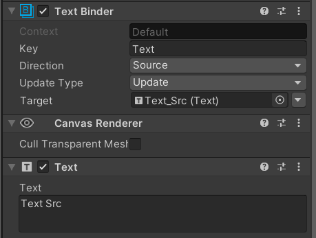
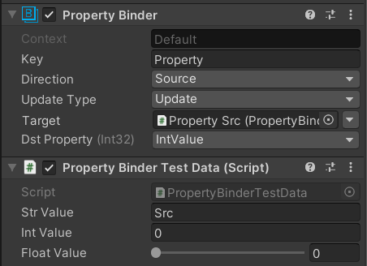
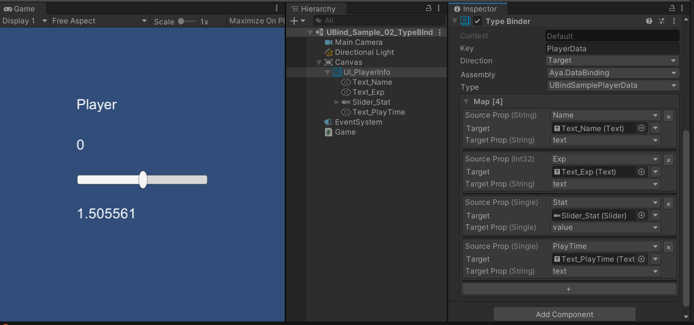

<div align="left">    

</div>

# UBind ***[Preview]***
**UBind** is a value binding component for Unity, which is used to quickly realize the association binding between UI and logical data.


[](https://openupm.com/packages/com.ls9512.ubind/)
 
 


[](https://996.icu)

[](https://github.com/ls9512/UBind/issues)
[](https://github.com/ls9512/UBind/pulls)
[](https://github.com/ls9512/UBind)

[[中文文档]](README_CN.md)

> Official QQ Group：[1070645638](https://jq.qq.com/?_wv=1027&k=ezkLnUln)

<!-- vscode-markdown-toc -->
* 1. [ Features](#Features)
* 2. [How to use](#Howtouse)
	* 2.1. [ Component](#Component)
		* 2.1.1. [Common Component Binder](#CommonComponentBinder)
		* 2.1.2. [Property Binder](#PropertyBinder)
		* 2.1.3. [Type Binder](#TypeBinder)
	* 2.2. [Programming](#Programming)
		* 2.2.1. [MonoBehaviour automatic binding](#MonoBehaviourautomaticbinding)
		* 2.2.2. [MonoBehaviour manual binding](#MonoBehaviourmanualbinding)
		* 2.2.3. [Manually bind any objects](#Manuallybindanyobjects)
* 3. [ Work mode](#Workmode)
	* 3.1. [ Passive callback mode](#Passivecallbackmode)
	* 3.2. [Active update mode](#Activeupdatemode)
* 4. [Built-in type](#Built-intype)
	* 4.1. [Attribute](#Attribute)
		* 4.1.1. [Bind Value Attribute](#BindValueAttribute)
		* 4.1.2. [Bind Type Attribute](#BindTypeAttribute)
	* 4.2. [Data Container](#DataContainer)
	* 4.3. [Data Binder](#DataBinder)
	* 4.4. [Data Converter](#DataConverter)
	* 4.5. [Component Binder](#ComponentBinder)
	* 4.6. [Bind Updater](#BindUpdater)
	* 4.7. [Bind Map](#BindMap)
* 5. [Built-in components](#Built-incomponents)
* 6. [Custom extension](#Customextension)
	* 6.1. [Custom Data Binder](#CustomDataBinder)
	* 6.2. [Custom Component Binder](#CustomComponentBinder)
	* 6.3. [Custom Binder Editor](#CustomBinderEditor)
	* 6.4. [Custom Data Converter](#CustomDataConverter)
* 7. [Notes](#Notes)
* 8. [Extension -- TextMeshPro](#Extension--TextMeshPro)

<!-- vscode-markdown-toc-config
	numbering=true
	autoSave=true
	/vscode-markdown-toc-config -->
<!-- /vscode-markdown-toc -->

***

##  1. <a name='Features'></a> Features
* Support two-way binding
* Support multiple data sources and multiple target objects
* Support any property and field binding of any component
* Support automatic type conversion when the data source and target data type are different
* Provide a large number of commonly used property binders for built-in components
* Binding of properties and fields of any runtime object
* Provide data containers to divide data usage domains by groups
* Extensible custom data binder, custom type converter

*** 

##  2. <a name='Howtouse'></a>How to use
###  2.1. <a name='Component'></a> Component
####  2.1.1. <a name='CommonComponentBinder'></a>Common Component Binder
You can use the built-in binder component to directly set the properties of common UI components as data sources or data targets:



####  2.1.2. <a name='PropertyBinder'></a>Property Binder
If you need to operate a custom component, or a component that does not provide a dedicated binder, you can use the more general **PropertyBinder**, and you can bind any property field of any component with a simple setting:



####  2.1.3. <a name='TypeBinder'></a>Type Binder
If you need to bind a data class to the corresponding UI, you only need to use **TypeBinder**, specify the assembly and class name of the data class, and then bind the corresponding properties and fields to the UI in turn, and then provide the data logic In the code, the code binds the data source:

``` cs
public class UBindSamplePlayerData
{
    public string Name;
    public int Exp;
    public float Stat;
    public float PlayTime;
}
```



``` cs
public class UBindSampleGameManager
{
    public UBindSamplePlayerData Player;

    public void Awake()
    {
        Player = new UBindSamplePlayerData() {Name = "Player",};
        UBind.BindSource("PlayerData", Player);
    }
}
```
###  2.2. <a name='Programming'></a>Programming
####  2.2.1. <a name='MonoBehaviourautomaticbinding'></a>MonoBehaviour automatic binding
By inheriting **BindableMonoBehaviour**, the ability to automatically handle the binding and unbinding of properties and fields is obtained.

Use **BindValue** Attribute to mark the need to bind basic type data:
``` cs
public class ExampleMonoBehaviour : BindableMonoBehaviour
{
	[BindValueSource("ValueKey")]
	public string ValueSource;

	[BindValueTarget("ValueKey")]
	public string ValueTarget;
}
```
Use **BindType** Attribute to mark the need to bind class and structure data:
``` cs
public class ExampleData
{
	public string Value;
}

public class ExanokeMonoBehaviour : BindableMonoBehaviour
{
	[BindTypeSource("TypeKey")]
	public ExampleData DataSource;

	[BindTypeTarget("TypeKey")]
	public ExampleData DataTarget;
}
```
####  2.2.2. <a name='MonoBehaviourmanualbinding'></a>MonoBehaviour manual binding
For custom **MonoBehaviour** objects that cannot be inherited, you can add the following code in the **OnEnable / OnDisable** method to manually call the binding and unbinding interfaces of **BindMap**, and you can get the same as automatic binding effect:
``` cs
public class ExanokeMonoBehaviour : MonoBehaviour
{
	[BindValueSource("ValueKey")]
	public string ValueSource;

	[BindValueTarget("ValueKey")]
	public string ValueTarget;

	public void OnEnable()
	{
		UBind.RegisterMap(this);
	}

	public void OnDisable()
	{
		UBind.DeRegisterMap(this);
	}
}
```
####  2.2.3. <a name='Manuallybindanyobjects'></a>Manually bind any objects
By calling various overloaded interfaces of **UBind**, you can bind values, attributes, fields, class objects, and structure objects at runtime. If you need to bind and unbind at a specific time, you need Cache the returned **DataBinder** object by itself:
``` cs
public class ExampleData
{
	public string Value;
}

public class ExampleClass
{
	public string ValueSource;
	public string ValueTarget;

	public ExampleData TypeSource;
	public ExampleData TypeTarget;

	private DataBinder _runtimeValueSourceBinder;
	private DataBinder _runtimeValueTargetBinder;

	private DataBinder _runtimeTypeSourceBinder;
	private DataBinder _runtimeTypeTargetBinder;

	public void BindTest()
	{
		_runtimeValueSourceBinder = UBind.BindSource<string>("ValueKey", () => ValueSource);
		_runtimeValueTargetBinder = UBind.BindTarget<string>("ValueKey", value => ValueTarget = value);

		_runtimeTypeSourceBinder = UBind.BindSource("TypeKey", TypeSource);
		_runtimeTypeTargetBinder = UBind.BindTarget("TypeKey", TypeTarget);
	}

	public void UnBindTest()
	{
		_runtimeValueSourceBinder.UnBind();
		_runtimeValueTargetBinder.UnBind();

		_runtimeTypeSourceBinder.UnBind();
		_runtimeTypeTargetBinder.UnBind();
	}
}
```
It should be noted that in the above example, the data source and the data target each generate a binder, which is the default and recommended way to use it in order to support multiple data sources and multiple data targets. However, the binding of the value class (**RuntimeValueBinder\<T\>**) can also be used to simplify the call in the following way, which will return the data source binder and data target binder at the same time:
``` cs
public class ExampleClass
{
	public string Source;
	public string Target;

	private DataBinder _sourceBinder;
	private DataBinder _targetBinder;

	public void BindTest()
	{
		(_sourceBinder, _targetBinder) = UBind.Bind<string>("Key", () => Source, value => Target = value);
	}

	public void UnBindTest()
	{
		_sourceBinder.UnBind();
		_targetBinder.UnBind();
	}
}
```

***


##  3. <a name='Workmode'></a> Work mode
###  3.1. <a name='Passivecallbackmode'></a> Passive callback mode
> **OnValueChangedTrigger** -> **DataBinder**(Source) --> **DataConverter** -->  **DataBinder**(Target) 

The default recommended mode, at this time the **NeedUpdate** property of **DataBinder** is **false**, the data is refreshed by the value change callback provided by the data source, notified to the data source binder, and broadcast to all The data target binder is then converted into target data bears through the data converter.

###  3.2. <a name='Activeupdatemode'></a>Active update mode
> **BindUpdater** -> **DataBinder**(Source) --> **DataConverter** -->  **DataBinder**(Target)

When the data source does not have the ability to actively trigger data changes, the framework provides a unified update cycle to actively detect the value changes, but this mode will inevitably cause performance loss. It should be used as little as possible, which is more suitable for rapid prototyping. In this mode, the **NeedUpdate** property of **DataBinder** is **true**, and the **AddListener()** and **RemoveListener()** methods need to be implemented to achieve specific callback registration and cancellation . The framework triggers the **UpdateSource()** method of all data sources in the **BindUpdater** component on a periodic basis to achieve data change detection and data update broadcasting.

***

##  4. <a name='Built-intype'></a>Built-in type
###  4.1. <a name='Attribute'></a>Attribute
####  4.1.1. <a name='BindValueAttribute'></a>Bind Value Attribute
It is used to mark attributes and fields that need to be bound in a class that has the ability to handle binding relationships. It is only recommended to bind common basic data types. The marked object will dynamically create a **RuntimeValueBinder** for processing.
####  4.1.2. <a name='BindTypeAttribute'></a>Bind Type Attribute
Unlike **BindValueAttribute**, it is used to mark custom class and structure type objects, and **RuntimeTypeBinder** is dynamically created for processing.
###  4.2. <a name='DataContainer'></a>Data Container
The data container is used to maintain a set of Data Binder, which can contain multiple data sources and data destinations. Each data container is independent of each other.

###  4.3. <a name='DataBinder'></a>Data Binder
The data binder is used to bind data to specific objects and its properties, and can be used to receive and broadcast data.
|Property|Description|
|-|-|
|Target|Data target object.|
|Context|The Key value of the data container, the default is **Default**, if there is no special requirement, you can keep the default setting.|
|Key|The Key value of the target data is the unique identification of the data in a single data container.|
|Direction|Data transfer direction, Source identifies the current binder as the data source, as the data broadcast sender, and Target identifies the current binder as the data receiver.|
|UpdateType|For target objects that do not provide data change callbacks, the data adopts the Update mode to detect whether changes have occurred. At this time, the update timing needs to be specified.|

###  4.4. <a name='DataConverter'></a>Data Converter
When the data types of the data source and the data target are different, the data converter corresponding to **(sourceType, targetType)** will be used to try the conversion.

The implementation of the default converter **CommonConverter** is as follows, which can be replaced by modifying **DataConverter.Default**:
``` cs
Convert.ChangeType(object data, Type type);
```
You can register specific types of custom converters in advance using the following interfaces as needed:
``` cs
DataConvert.Register(Type sourceType, Type targetType, DataConverter dataConverter);
```

###  4.5. <a name='ComponentBinder'></a>Component Binder
The Unity Component version of the data binder needs to realize generic binding with a specific binder to realize the binding of component data.

###  4.6. <a name='BindUpdater'></a>Bind Updater
Based on the **MonoBehaviour** life cycle implementation, it is used to uniformly maintain the update cycle of **DataBinder** that needs to actively update data.

###  4.7. <a name='BindMap'></a>Bind Map
Used to cache all the binding structure information of the objects marked by **BindAttribute**.

***

##  5. <a name='Built-incomponents'></a>Built-in Components
|Component|Binding object type|Default binding property|Binding property type|
|-|-|-|-|
|Text Binder|Text|text|string|
|Text FontSize Binder|Text|fontSize|int|
|Text Format Value Binder|Text|text|float|
|InputField Binder|InputField|text|string|
|Slider Binder|Slider|value|float|
|Scrollbar Binder|Scrollbar|value|float|
|Dropdown Binder|Dropdown|value|int|
|Dropdown List Binder|Dropdown|options|List<Dropdown.OptionData>|
|CanvasGroup Binder|CanvasGroup|alpha|float|
|Toggle Binder|Toggle|value|bool|
|Color Binder|Graphic|color|Color|
|Image Binder|Image|sprite|Sprite|
|Image FillAmount Binder|Image|fillAmount|float|
|RawImage Binder|RawImage|texture|Texture|
|Property Binder|Component|||
|Type Binder|Component||

***

##  6. <a name='Customextension'></a>Custom Extension
###  6.1. <a name='CustomDataBinder'></a>Custom Data Binder
Implement a runtime data binder for a specific object and property by inheriting **DataBinder**:
``` cs
public class RuntimeImageFillAmountBinder : DataBinder<Image, float>
{
	public override float Value
	{
		get => Target.fillAmount;
		set => Target.fillAmount = value;
	}
}
```

###  6.2. <a name='CustomComponentBinder'></a>Custom Component Binder
If you need to use it as a component, you need to additionally implement the corresponding **ComponentBinder**:
``` cs
[AddComponentMenu("Data Binding/Image FillAmount Binder")]
public class ImageFillAmountBinder : ComponentUpdateBinder<Image, float, RuntimeImageFillAmountBinder>
{
}
```

###  6.3. <a name='CustomBinderEditor'></a>Custom Binder Editor
If the component needs to maintain the basic component style and extend custom properties and styles, it needs to implement the corresponding **ComponentBinderEditor**, which is generically associated with the binder component and the runtime binder:
``` cs
#if UNITY_EDITOR
using UnityEditor;

[CustomEditor(typeof(ImageFillAmountBinder)), UnityEditor.CanEditMultipleObjects]
public class ImageFillAmountBinderEditor : ComponentBinderEditor<Image, float, RuntimeImageFillAmountBinder>
{
}
#endif
```

###  6.4. <a name='CustomDataConverter'></a>Custom Data Converter
If you need to transfer different data types and the data is not what **Convert.ChangeType()** can handle, you need a custom data converter that implements this type conversion:
``` cs
public class CustomDataConverter : DataConverter
{
	public object To(object data, Type targetType)
	{
		object result;
		// To do something...
		return result;
	}
}
```
Before you need to use these binders, such as when the game is initialized, register a custom binder:
``` cs
var sourcetType = sourceData.GetType();
var targetType = targetData.GetType();
DataConverter.Register((sourceType, targetType), new CustomDataConverter());
```

***

##  7. <a name='Notes'></a>Notes
* OnValueChanged is only available for data sources.
* All parameters must be configured in the editor mode. Modifying the parameters during operation is invalid.
* TypeBinder temporarily only supports simple data classes with single-level property.
* Although the component supports automatic conversion of different data types, it is still recommended to pass the same data type directly to optimize performance.
* The data between multiple data sources will not be synchronized. If the data sources also need to be synchronized, the Direction must be set to Both.
* PropertyBinder and TypeBinder rely on reflection to achieve, but due to the property encapsulation of some native components, direct reflection to modify the field does not refresh the display. It may be necessary to manipulate the corresponding properties or customize a dedicated binder.

***

##  8. <a name='Extension--TextMeshPro'></a>Extension -- TextMeshPro
* TMP Text Binder
* TMP Text Format Value Binder